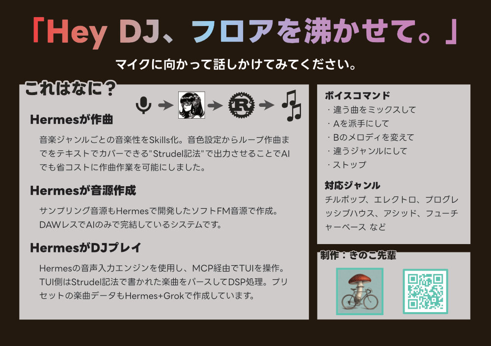

# dj-hermes

**「Hey DJ、フロアを沸かせて。」**



## これはなに？

生成AIなんでも展示会 vol.6 で展示したライブDJシステムです。

- **Hermes が作曲** — ジャンルごとの音楽性を Skills 化。音色からループまでを [Strudel 記法](https://strudel.cc/) のテキストで出すので、AI でも省コストに曲を変えられる
- **Hermes が音源作成** — サンプリング音源もソフト FM で作成。DAW なしで AI だけで完結する
- **Hermes が DJ プレイ** — 音声入力 → MCP で TUI を操作。TUI が Strudel 記法をパースして DSP。プリセット曲も Hermes + Grok で作成

## 自宅で試す

### 1. リリースを展開

[Releases](https://github.com/sin5ddd/dj-hermes/releases) から OS 向けのアーカイブを取り、展開します。中身は実行ファイル、`songs/`（曲）、`samples/`（WAV）、`docs/profile/dj-hermes`（Hermes プロファイル）です。

| OS      | ファイル                                    |
| ------- | ------------------------------------------- |
| Windows | `dj-hermes-x86_64-pc-windows-msvc.zip`      |
| Linux   | `dj-hermes-x86_64-unknown-linux-gnu.tar.gz` |

Rust があるならリポジトリをクローンして `cargo install --path . --locked` でも実行ファイルは作れます。その場合の WAV は `git lfs install` のあと `git lfs pull`。Linux は ALSA 開発ヘッダ（例: `libasound2-dev`）が必要なことがあります。

### 2. Hermes プロファイル

Hermes が必要です。展開したフォルダを開いた状態で、Hermes に次を頼んでください。

> docs/profile/dj-hermesをプロファイルに追加して

手作業のコピー手順は [docs/profile/dj-hermes/README.md](./docs/profile/dj-hermes/README.md) にあります。展示と同じ隔離設定（MCP と作曲スキルだけ）になります。

### 3. 起動

プロファイルを入れてから、展開したディレクトリ（`songs/` と `samples/` がある場所）で起動します。

```bash
dj-hermes dj songs/house/01.strudel songs/four-on-the-floor/01.strudel
```

- Hermes のウェイクキーワード機能をオンにして、「Hey DJ」で指示できます。
- キーボードの自然文（例: `暗くして`）も同じ
- `/` 付き（例: `/x 4`）はローカルコマンド
- 終了は `/quit`。プロンプトが空なら Esc でも可

1 曲だけなら `dj-hermes play songs/house/01.strudel`。

## ボイスコマンド

ブースと同じ言い方で足ります。

- 違う曲をミックスして
- A を派手にして
- B のメロディを変えて
- 違うジャンルにして
- ストップ

## 対応ジャンル

チルポップ、エレクトロ、プログレッシブハウス、アシッド、フューチャーベースなど。同梱曲は `songs/<genre>/01.strudel`。

あまり詳しくないジャンルの音楽性についてはごめんなさい。。

## 詳しく

| 知りたいこと           | 場所                                                                                 |
| ---------------------- | ------------------------------------------------------------------------------------ |
| Hermes プロファイル    | [docs/profile/dj-hermes/](./docs/profile/dj-hermes/)                                 |
| 作曲スキル             | [docs/profile/dj-hermes/skills/creative/](./docs/profile/dj-hermes/skills/creative/) |
| 開発・モジュール構成   | [AGENTS.md](./AGENTS.md)                                                             |

`dj-hermes help` でフラグ一覧が出ます。

## License

ソースコードは **MIT OR Apache-2.0**（[`LICENSE-MIT`](./LICENSE-MIT) / [`LICENSE-APACHE`](./LICENSE-APACHE)）。
`samples/` の同梱 WAV は **CC0 1.0**（[`samples/LICENSE.md`](./samples/LICENSE.md)）。
本プロジェクトは Strudel 互換ミニ記法の **独立した再実装** であり、[uzu/strudel](https://codeberg.org/uzu/strudel)（AGPL-3.0）のソースは含まない。公式 Strudel プロジェクトではない。
第三者クレートの表示は [`THIRD_PARTY.md`](./THIRD_PARTY.md)。
